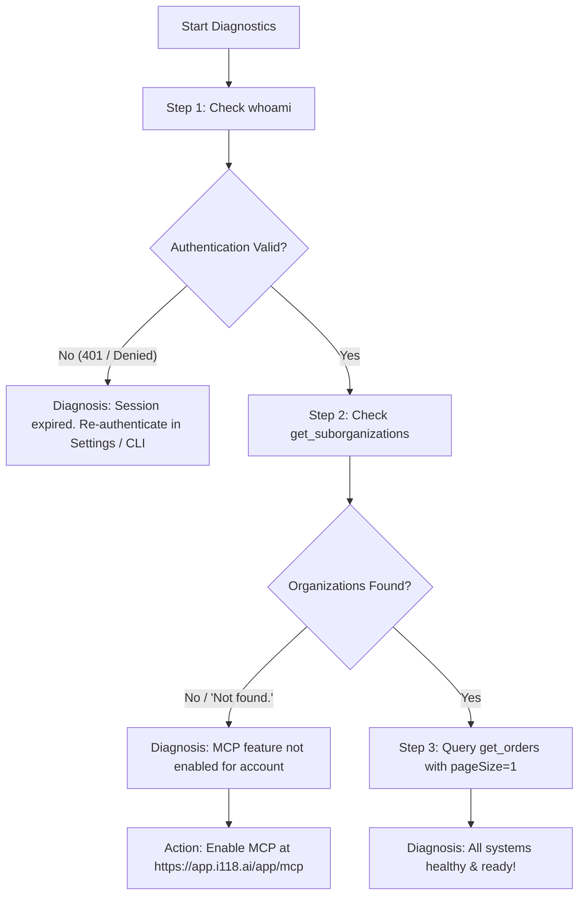

# i118 Phone Assistant Setup, Account Switching & Diagnostics

This skill guides you through connecting your **i118 Phone Assistant** account, switching connected i118 Phone Assistant business accounts, and diagnosing connection health in Claude Code, ChatGPT, and Codex.

---

## 1. Connecting i118 Phone Assistant by Environment

### A. Claude Code CLI (Terminal)
1. Type `/mcp` in an interactive session, or run:
   ```bash
   claude mcp login i118
   ```
2. Follow the browser authorization prompt.

### B. ChatGPT (published app)
1. Find and install **i118 Phone Assistant** from the ChatGPT app directory.
2. Choose **Connect** when prompted and complete the i118 Phone Assistant OAuth flow in your browser.
3. Confirm the connection by asking: *"Check my i118 Phone Assistant connection."*

ChatGPT users do not configure an MCP URL for the published app.

### C. Codex
1. Install the i118 Phone Assistant plugin from its configured marketplace.
2. Complete the i118 Phone Assistant authorization prompt.
3. Ask: *"Check my i118 Phone Assistant connection."*

For local plugin development, reinstall the plugin and start a new chat after changing the plugin source. An already-open Codex chat does not automatically reload local manifest or skill changes.

> [!NOTE]
> The Claude Code plugin manifest in this repository does not install skills or the state helper into Claude Desktop, Claude Cowork, Claude.ai, or Claude mobile. Configure a supported MCP connector separately in those surfaces when available.

---

## 2. Switching Connected i118 Phone Assistant Accounts

> [!NOTE]
> Switching accounts refers to switching **which i118 Phone Assistant business or organization account** is connected to the AI plugin. You **do not** need to sign out of your Claude or ChatGPT account.

If you manage multiple i118 Phone Assistant accounts (e.g. separate restaurants or business entities) and want to link a different account:

### Step 1: Sign out in the i118 Phone Assistant Web Portal
Because your browser caches your active login session:
1. Open your browser and go to **[https://app.i118.ai](https://app.i118.ai)**.
2. In the i118 Phone Assistant portal, click your user profile and choose **Sign Out**.
3. Sign into your **new i118 Phone Assistant business account** (and verify MCP is active at **[https://app.i118.ai/app/mcp](https://app.i118.ai/app/mcp)**).

### Step 2: Reconnect in your AI Environment
* **In Claude Code (CLI)**: Run `claude mcp logout i118` then `claude mcp login i118`. If you need to discard the previous account's local order cursor, reset only that organization with `I118_STATE_NAMESPACE=orders node "${CLAUDE_PLUGIN_ROOT}/skills/i118-order-routine/scripts/state_engine.js" reset <subOrganizationId>`. Reset other workflow namespaces separately when applicable.
* **In local Codex**: Disconnect and re-authorize the i118 connection. If the plugin is installed from a local checkout, reinstall it and use a new chat before retesting. If local routine state must be discarded, reset only that organization in each applicable `I118_STATE_NAMESPACE` with the helper bundled in the `i118-order-routine` skill.
* **In hosted ChatGPT**: Disconnect i118 Phone Assistant in the Apps or Connected Apps settings, then reconnect it from the app directory and re-authorize. A state reset affects only the active hosted runtime; ChatGPT does not use or clear another device's local state.

The browser window will now link your new i118 Phone Assistant business account!

---

## 3. Diagnosing Your Connection

You can test your connection at any time simply by asking in chat:
> *"Check my i118 Phone Assistant connection and test my setup."*

The plugin will automatically perform the following diagnostic steps:



---

## 4. Troubleshooting Reference

| Symptom | Root Cause | Exact Resolution |
| :--- | :--- | :--- |
| **No tools listed in ChatGPT** | The published app is not connected in this ChatGPT account or the current chat has not loaded it | Confirm i118 Phone Assistant is installed from the app directory, disconnect/reconnect it from Apps or Connected Apps settings, then start a new chat. |
| **No MCP tools listed / Denied access** | MCP access is not enabled for your i118 Phone Assistant account | Go to **[https://app.i118.ai/app/mcp](https://app.i118.ai/app/mcp)** in your browser and enable MCP access, then reconnect. |
| **Connecting logs into the wrong i118 Phone Assistant account** | Browser still holds cookie for a previous i118 Phone Assistant account | Go to **[https://app.i118.ai](https://app.i118.ai)**, sign out, sign in to your new i118 Phone Assistant account, then reconnect. |
| **`401 Unauthorized` / Session expired** | Authorization token needs to be refreshed | Reconnect the configured i118 Phone Assistant connection; in Claude Code, run `claude mcp login i118`. |
| **`Not found.` on orders** | You do not own the organization ID being queried | Ask: *"Show my available organizations"* to verify accessible store IDs. |
| **`The filters changed. Restart without a cursor.`** | Date filter was changed during cursor pagination | Ask: *"Start a fresh search for today's orders."* |

When requesting support, provide the client (Claude Code, ChatGPT, or Codex), tool name, and full non-sensitive error text. Do not provide OAuth tokens, authorization codes, or screenshots containing them.
